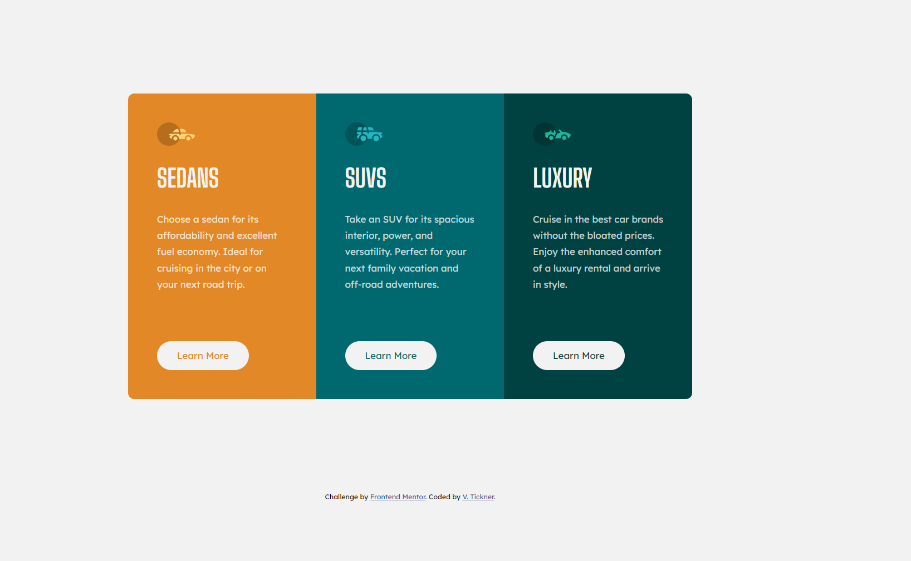

# Frontend Mentor - 3-column preview card component solution

This is a solution to the [3-column preview card component challenge on Frontend Mentor](https://www.frontendmentor.io/challenges/3column-preview-card-component-pH92eAR2-).

## Table of contents

- [Overview](#overview)
  - [Screenshot](#screenshot)
  - [Links](#links)
- [My process](#my-process)
  - [Built with](#built-with)
  - [What I learned](#what-i-learned)
  - [Continued development](#continued-development)
  - [Useful resources](#useful-resources)
- [Author](#author)

## Overview

The challenge was to build a 3 column preview card component and get the design for both the mobile and desktop versions to look as close as possible to the provided images. It also included using hover states for the button elements.

### Screenshot

### Links

- Solution URL: [https://github.com/VTickner/frontend-mentor-3-column-card-component](https://github.com/VTickner/frontend-mentor-3-column-card-component)
- Live Site URL: [https://vtickner.github.io/frontend-mentor-3-column-card-component/](https://vtickner.github.io/frontend-mentor-3-column-card-component/)

## My process

- Created semantic HTML first
- Created CSS selectors to:
  - create custom variables to contain the various colours used in the design
  - used a CSS reset
  - layout the design using Grid and Flexbox
  - style the various elements, adding in hover states for the buttons
  - added in `:focus` styling for accessibility purposes
  - create a different width layout for mobile version turning the card component into a column

### Built with

- Semantic HTML markup
- CSS custom properties
- Grid
- Flexbox
- Desktop-first workflow (responsive design)
- Google Fonts

### What I learned

Was able to put into practice CSS knowledge of grid, flexbox, custom properties and `:focus`.

### Continued development

Gain extra practice on more complicated layout designs.

### Useful resources

- [Google Fonts](https://fonts.google.com/) - Fonts used in the design were [Big Shoulders Design](https://fonts.google.com/specimen/Big+Shoulders+Display) using Bold 700 and [Lexend Deca](https://fonts.google.com/specimen/Lexend+Deca) using regular 400 font styles.

## Author

- Frontend Mentor - [@VTickner](https://www.frontendmentor.io/profile/VTickner)
